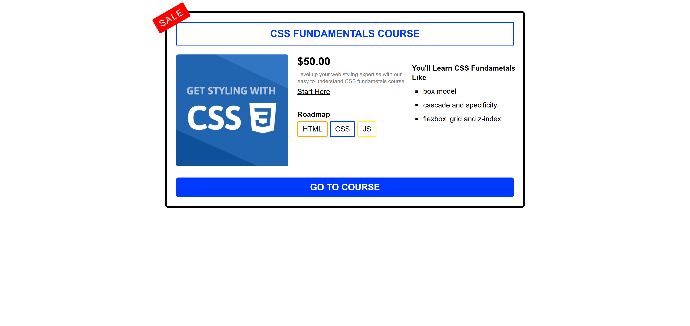
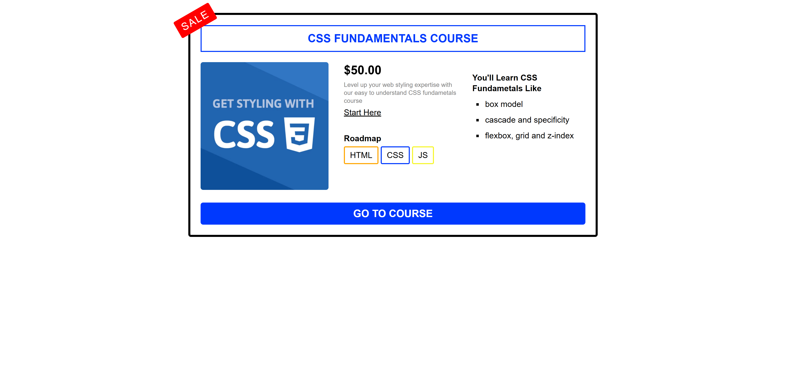

# 🌐 CSS Layouts Projects

This repository contains **three projects** built as part of the  
🎓 **[CSS Layouts](https://almdrasa.com/tracks/frontend/courses/css-layouts/)** course offered by [Almdrasa](https://almdrasa.com).

In this course, I learned modern CSS layout techniques, including **floats, Flexbox, and Grid**, and explored positioning strategies (relative, absolute, fixed) to build responsive, flexible page layouts.

---

## 📂 Project Structure

### 1️⃣ #1_float
* `index.html` → Main course card page using **CSS floats**  
* `style.css` → Styles for float-based layout  
* `images/` → Images used in the page  

### 2️⃣ #2_flexBoxProject
* `index.html` → Main course card page using **Flexbox**  
* `style.css` → Styles for Flexbox layout  
* `images/` → Images used in the page  

### 3️⃣ #3_gridProject
* `index.html` → Main course card page using **CSS Grid**  
* `style.css` → Styles for Grid layout  
* `images/` → Images used in the page  

---

## 🚀 Features

* ✅ **Float-based Layout** – Classic CSS layout using `float`  
* ✅ **Flexbox Layout** – Modern flexible layout with `display: flex`  
* ✅ **Grid Layout** – Advanced layout using `display: grid`  
* ✅ **Responsive Course Card** – Each project displays a course card with price, roadmap, and features  
* ✅ **Semantic HTML Structure** – Using `article`, `ul`, `li`, `p`, `h1`, `h4` tags  
* ✅ **CSS Variables** – For consistent color theming  

---

## 🎯 What I Learned

* Transitioning from **floats** to **Flexbox** and **Grid**  
* Modern CSS layout techniques and best practices  
* Structuring **responsive course cards** with semantic HTML  
* Using **CSS custom properties** for reusable colors and styling  
* Organizing content visually and semantically for maintainability  

---

## 📸 Preview

### 🔹 Float Layout

### 🔹 Flexbox Layout

### 🔹 Grid Layout

---

## ✅ Run the Projects

Open each `index.html` file in your browser to view the project.  
Navigation and layout differences can be observed between Float, Flexbox, and Grid versions.

---

👨‍💻 Created by [**Nabil**](https://www.linkedin.com/in/nabil-el-amrawy/) as part of the CSS Layouts course practice.
